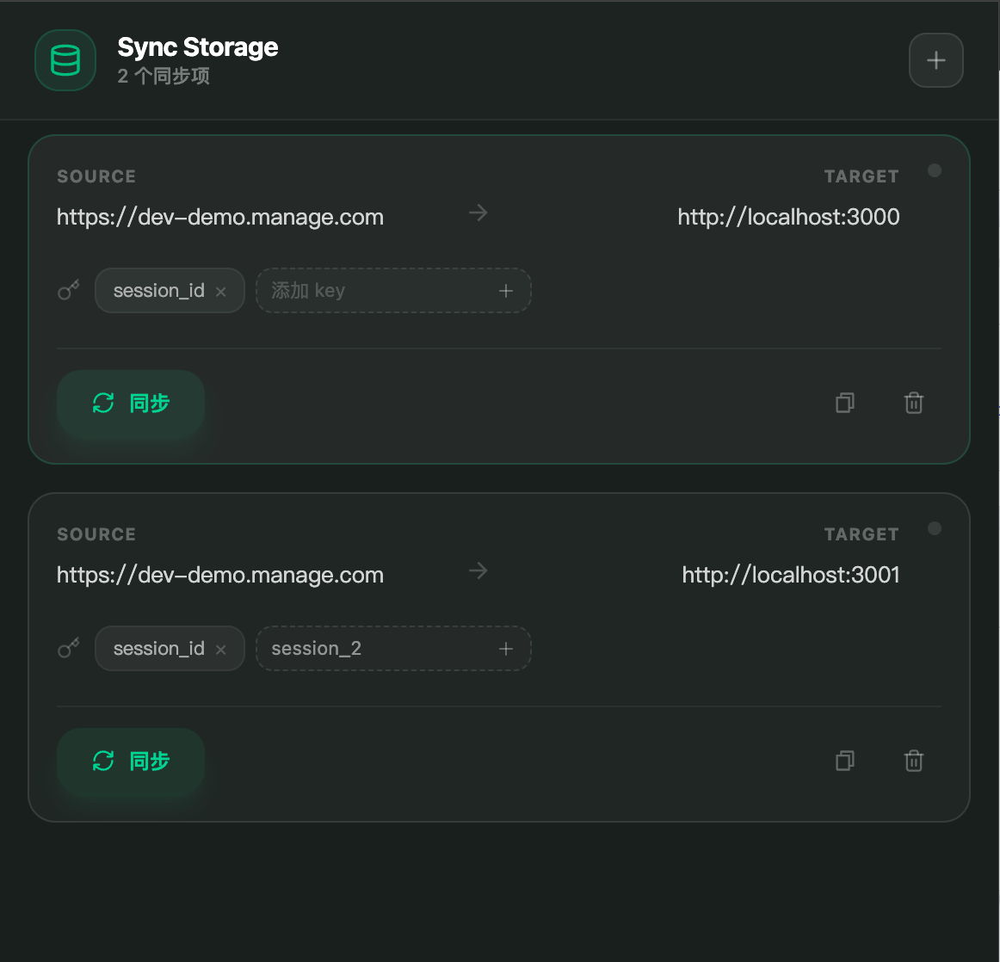

# sync-storage

A chrome extension for synchronize different website localStorage/sessionStorage/cookies.

## When to use

It is usually used to facilitate web development.

Here is what it can do:
1. Manual synchronization: If the source website or the target website is not opened in the browser, a new tab will be automatically opened to assist next action,and if the source website storage has the settings keys data, it will be synchronized to the target website storage.
2. Automatic synchronization: You only need to fill in the source website url and the target website url and then click the listening button.When both the source website and the target website are ready and the corresponding keys exist in the source website, the data will be automatically synchronized to the target website storage.

## Get started


1. **Install dependencies**

    ```bash
    pnpm install
    ```

2. **Start development**

    ```bash
    pnpm dev
    ```

3. **Load extension in Chrome**

    - Open Chrome and navigate to `chrome://extensions/`
    - Enable "Developer mode" in the top right
    - Click "Load unpacked"
    - Select the `dist` folder from your project

4. **Build for production**
    ```bash
    pnpm build
    ```

**_I'm very happy to see you submit a PR to make it better._**

## Screen shot



## License

This repository is licensed under the [MIT](LICENSE)
