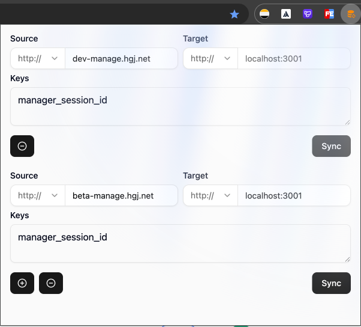

# SyncStorage

A chrome extension for synchronize different domains's localStorage/sessionStorage.

## When use?

When you need to synchronize the unique identifier stored in the storage of the company server's development environment to the local development environment, maybe you need it.

## Preconditions

Before Listening target url, open it.(There is no such restriction in the source URL.)

## Usage

```sh
# 1. compile
pnpm i
pnpm run build
# 2. open chrome://extensions/
# 3. load the dist directory to chrome extension
```



Make sure you've already open Target tab, otherwise, you need to reclick the `Sync Button`.
