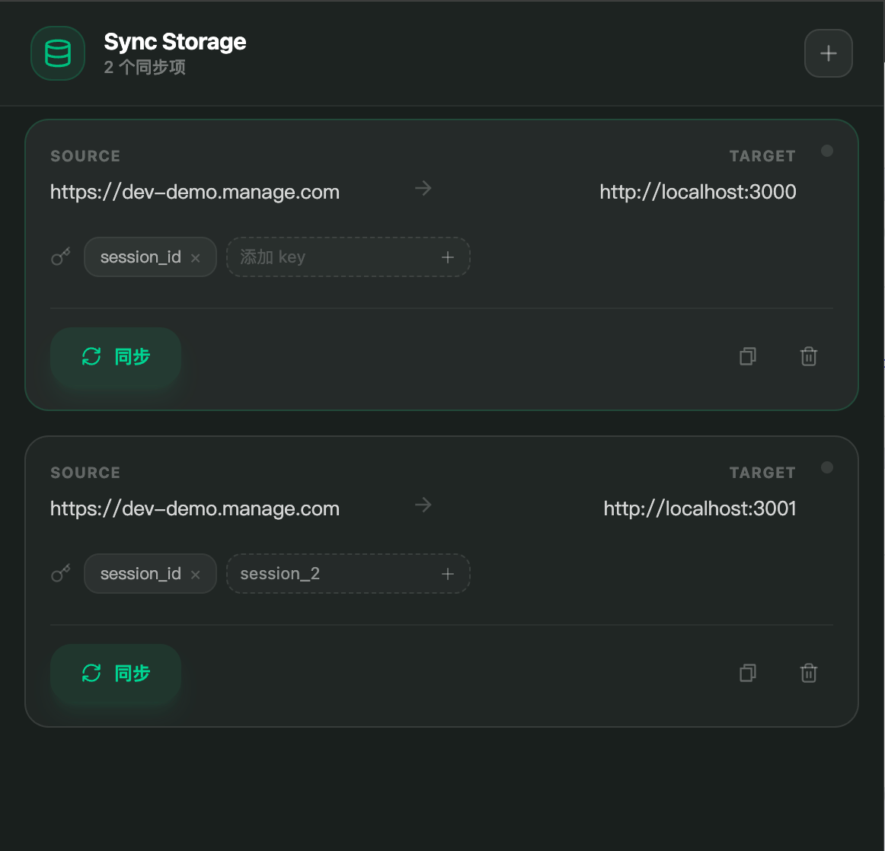

# sync-storage

A chrome extension for synchronize different website localStorage/sessionStorage/cookies.



## Introduction

Sync Storage is a must-have efficiency booster for frontend developers. It syncs localStorage, sessionStorage and Cookies across sites with one click, supports real-time monitoring of source site data changes and auto-sync to the target site. With simple configuration, you can seamlessly sync login status and business data across environments, say goodbye to manual copying, and greatly improve development, debugging and testing efficiency.

## Get Started

1. Launch your local project.
2. Click `SyncStorage` Icon on Chrome, config Source/Target url and keys you want to synced.
3. Click the button `Sync`. If you haven't open Source/Target websitt, it will open them.
   - If you're already logged in, it will immediately synchronize the keys you have configured.
   - If not, it will hang until you complete the login process.

## Develop

1. **Install dependencies**

    ```bash
    pnpm install
    ```

2. **Start development**

    ```bash
    pnpm dev
    ```

3. **Load extension in Chrome**
    - Open Chrome and navigate to `chrome://extensions/`
    - Enable "Developer mode" in the top right
    - Click "Load unpacked"
    - Select the `dist` folder from your project

4. **Build for production**
    ```bash
    pnpm build
    ```

**_I'm very happy to see you submit a PR to make it better._**

## License

This repository is licensed under the [MIT](LICENSE)
